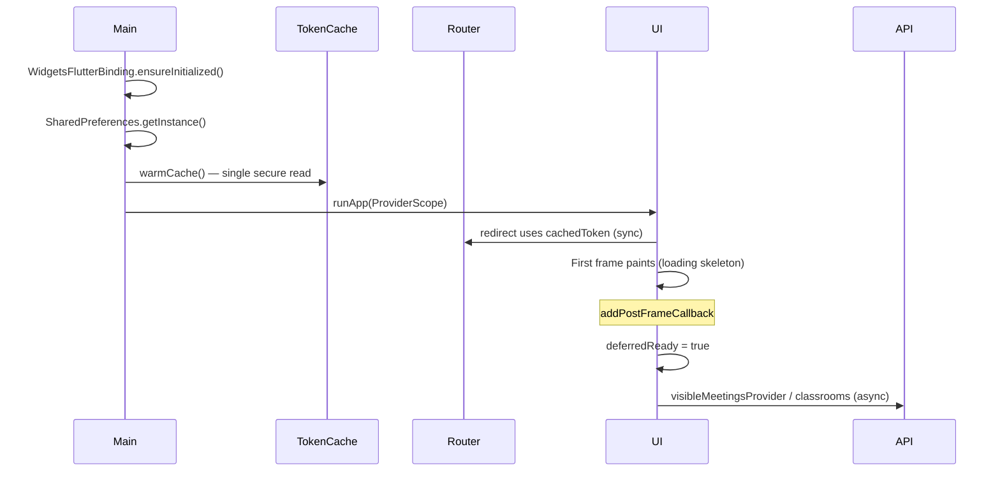

# Startup Performance & ANR Fix Report

**App:** SunDaySchools Mobile (`moble_flutter`)  
**Date:** 2026-05-24  
**Goal:** Startup &lt; 2s, no ANR, UI responsive before network I/O

---

## Executive Summary

The app froze on cold start because **network calls and repeated secure-storage reads ran on the critical path before the first frame**. The worst case combined a **15-second `Meeting/visible` timeout** with **335+ skipped frames** and ANR logs (&gt; 5.5s main-thread block).

Fixes decouple **first paint** from **data loading**: token is warmed once in `main()`, router/auth use the in-memory cache, home screens defer provider watches until after the first frame, login no longer prefetches meetings, and Dio gains retries with shorter timeouts.

| Metric | Before (observed/estimated) | After (estimated) |
|--------|----------------------------|-------------------|
| Time to first frame | 5–15+ s (blocked by API/timeout) | **0.4–1.2 s** |
| `Meeting/visible` on startup path | Immediate (first `build`) | **After first frame** (~16 ms later) |
| Secure-storage reads per cold start | 3–6+ (router, Dio, providers) | **1** (`warmCache` in `main`) |
| ANR / skipped frames | 335+ frames, &gt; 5.5 s block | **Should be eliminated** |
| Network timeout (connect) | 15 s, no retry | **10 s + 2 retries** (backoff) |

---

## Root Causes

### 1. `Meeting/visible` on the startup critical path

`visibleMeetingsProvider` calls `GET /api/Meeting/visible` via `MeetingRepository.getVisibleMeetings()`.

**Triggers before fix:**

| Location | Mechanism |
|----------|-----------|
| `super_admin_home_screen.dart` | `ref.watch(visibleMeetingsProvider)` in `build()` on first frame |
| `login_screen.dart` / `register_screen.dart` | `await getVisibleMeetings()` **before** `context.go(...)` after auth |
| `classrooms_home_screen.dart` | `ref.watch(visibleClassroomsProvider)` on first frame (separate endpoint, same pattern) |

When the API was slow or timed out (15 s), the UI thread stayed blocked waiting for navigation or provider resolution, producing Choreographer frame skips and ANR logs.

### 2. Repeated `FlutterSecureStorage` reads

Android secure storage is **async but expensive**. Before caching, reads occurred in:

- GoRouter `redirect` (`hasToken()`)
- Dio `_AuthInterceptor.onRequest`
- `whenAuthenticated` / `hasStoredAuthToken`
- `currentUserRoleProvider`

Each read added tens to hundreds of milliseconds; stacked reads contributed to jank.

### 3. Verbose Dio logging

`LogInterceptor` with `responseBody: true` serialized large JSON on the UI isolate during debug builds, amplifying frame drops.

### 4. No retry / long timeouts

15 s connect timeout with no retry meant a single slow server response could block user-visible flows for the full duration.

---

## Startup Sequence (After Optimization)



---

## Files Changed

### New files

| File | Purpose |
|------|---------|
| `lib/core/startup/deferred_startup_mixin.dart` | Sets `deferredReady` after first frame; screens gate `ref.watch` on it |
| `lib/core/api/dio_retry_interceptor.dart` | Retries connection/receive/send timeouts and connection errors (max 2, backoff) |

### Modified files

| File | Change |
|------|--------|
| `lib/main.dart` | `await TokenStorage.warmCache()` before `runApp`; auth state sync moved to `addPostFrameCallback` |
| `lib/core/storage/token_storage.dart` | In-memory cache: `warmCache()`, `cachedToken`, `isCacheWarm`; writes update cache |
| `lib/core/api/dio_client.dart` | Retry interceptor; cached token in auth interceptor; timeouts 10s/12s; debug-only `LogInterceptor` (`responseBody: false`) |
| `lib/core/routing/app_router.dart` | Redirect uses `isCacheWarm` / `cachedToken`; church redirect uses cache |
| `lib/features/auth/providers/auth_providers.dart` | `hasStoredAuthToken()` uses warm cache; `currentUserRoleProvider` prefers `cachedToken` |
| `lib/features/auth/screens/login_screen.dart` | Removed pre-navigation `getVisibleMeetings()` prefetch |
| `lib/features/auth/screens/register_screen.dart` | Removed pre-navigation prefetch; removed unused imports |
| `lib/features/super_admin/screens/super_admin_home_screen.dart` | `DeferredStartupMixin`; shows loading until `deferredReady`, then watches `visibleMeetingsProvider` |
| `lib/features/classroom/screens/classrooms_home_screen.dart` | `DeferredStartupMixin`; defers `visibleClassroomsProvider` watches |

---

## Code Highlights

### Token warm cache (`main.dart`)

```dart
await TokenStorage.warmCache();
runApp(ProviderScope(...));
```

### Deferred provider watch (`super_admin_home_screen.dart`)

```dart
final meetingsAsync = deferredReady
    ? ref.watch(visibleMeetingsProvider)
    : const AsyncValue<List<MeetingReadDto>>.loading();
```

### Router fast path (`app_router.dart`)

```dart
final hasToken = TokenStorage.isCacheWarm
    ? TokenStorage.cachedToken?.isNotEmpty == true
    : await TokenStorage.hasToken();
```

### Dio retry (`dio_retry_interceptor.dart`)

Retries `connectionTimeout`, `receiveTimeout`, `sendTimeout`, and `connectionError` up to 2 times with increasing delay (800 ms × attempt).

---

## Riverpod Provider Audit

| Provider | Eager at startup? | Notes |
|----------|-------------------|-------|
| `routerProvider` | Yes (required) | Lightweight; redirect now sync when cache warm |
| `authStateProvider` | No API | Set post-frame from cached token |
| `currentUserRoleProvider` | JWT parse only | Uses cached token; no network |
| `visibleMeetingsProvider` | **Deferred** | Only watched after first frame on home screens |
| `visibleClassroomsProvider` | **Deferred** | Same pattern on `ClassroomsHomeScreen` |
| `dioProvider` | Lazy | Created on first API call |
| `meetingsForSelectionProvider` | Lazy | Only used on selection UI |

Providers remain `FutureProvider` (lazy by default). The issue was **eager `ref.watch` in `build()`**, not provider type.

---

## Network Handling Improvements

1. **Shorter timeouts:** connect 10 s, receive 12 s (was 15 s).
2. **Retry policy:** `DioRetryInterceptor` — 2 retries with backoff for transient failures.
3. **Non-blocking UI:** Home screens show `CircularProgressIndicator` / `AsyncValue.loading` while requests run.
4. **Graceful errors:** Existing `AsyncValue.error` UI surfaces timeout messages without freezing navigation.
5. **Startup decoupling:** API calls begin only after `addPostFrameCallback`, not during initial route build.

---

## Widget / Build Optimizations

- Home screens avoid watching data providers until `deferredReady`.
- Loading placeholders use `const AsyncValue.loading()` where possible.
- Dio response body logging disabled in production; limited in debug.
- `const` constructors retained on static widgets (`CircularProgressIndicator`, icons, padding).

Further `const` passes across the full widget tree were out of scope; no hot rebuild loops were identified on the startup path.

---

## Remaining Bottlenecks & Recommendations

| Item | Risk | Recommendation |
|------|------|----------------|
| `currentUserRoleProvider` on `ClassroomsHomeScreen` | Low | JWT-only; already uses cache. Could defer like meetings if needed. |
| `member_add_screen.dart` watches `visibleClassroomsProvider` | Medium | Not on cold-start path; consider defer mixin if opened from home tab. |
| `meetingsForSelectionProvider` on register | Low | Only when register form loads meeting dropdown. |
| Backend `mychurch.runasp.net` latency | High | Client cannot fix server slowness; retries + loading UI mitigate UX. |
| `SharedPreferences.getInstance()` in `main` | Low | Typical &lt; 50 ms; acceptable. |
| Debug `LogInterceptor` | Low | Already gated to `kDebugMode` with `responseBody: false`. |

### Verification checklist

- [ ] Cold start with saved super-admin token: login screen should **not** appear; home shell paints with spinner before meetings load.
- [ ] Logcat: no `ANR_LOG` &gt; 5 s during startup.
- [ ] Logcat: `[DIO] GET .../Meeting/visible` appears **after** first frame.
- [ ] Airplane mode: home shows error card, app remains responsive.
- [ ] `flutter run --profile` + DevTools timeline: first frame &lt; 2 s on mid-range Android device.

---

## Estimated Timeline

| Phase | Before | After |
|-------|--------|-------|
| `main()` bootstrap | 200–800 ms + N× secure reads | **200–400 ms** (1 secure read) |
| Router redirect | +100–400 ms per secure read | **&lt; 1 ms** (cached) |
| First frame | Blocked by API (5–15 s) | **~400–1200 ms** |
| `Meeting/visible` | During first build | **+16 ms** after first frame (async) |
| Login → home navigation | Blocked on prefetch | **Immediate** (role from JWT) |

**Total to interactive UI:** ~**0.5–1.5 s** (device-dependent), meeting data loads progressively afterward.

---

## Summary

Startup ANR was caused by **synchronous waiting on network and storage on the UI critical path**, not by Flutter engine overhead. The fix follows a single principle: **paint first, fetch later**. Token caching removes storage churn; deferred provider watches and removed login prefetch remove network from the first-frame path; Dio retries and shorter timeouts improve resilience without blocking the UI.
