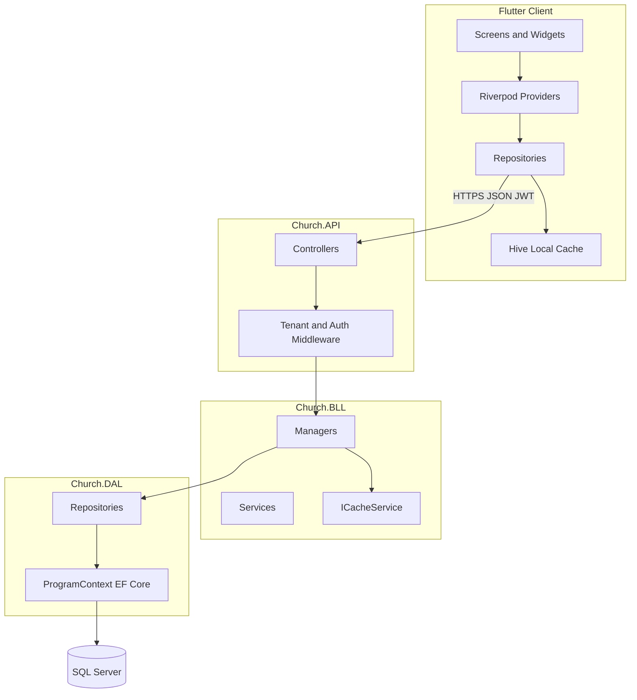

# Church — Multi-Tenant Church Management System

[](https://dotnet.microsoft.com/)
[](https://dotnet.microsoft.com/apps/aspnet)
[](https://flutter.dev/)
[](https://www.microsoft.com/sql-server)
[](https://jwt.io/)
[](https://learn.microsoft.com/aspnet/core/fundamentals/)

**Church** is a production-oriented church management platform for organizing Sunday schools and youth ministries. It combines an **ASP.NET Core 8 Web API** with a **Flutter** mobile client to help churches manage members, servants, meetings, classrooms, attendance, and tenant-specific configuration — with strong multi-tenancy, role-based security, and bilingual support (English / Arabic).

---

## Overview

| Layer | Technology | Responsibility |
|-------|------------|----------------|
| **Mobile** | Flutter + Riverpod | Role-aware UI, offline-friendly local cache, JWT auth |
| **API** | ASP.NET Core 8 | REST endpoints, JWT, Swagger, tenant middleware |
| **BLL** | C# class library | Business rules, DTOs, caching, unified forms |
| **DAL** | EF Core 8 + SQL Server | Entities, repositories, migrations, Identity |

The mobile app talks to the API over HTTPS. Each church operates as an isolated tenant; data is scoped by `ChurchId` (and often `MeetingId`) at the database query-filter level and in JWT claims.

---

## Features

### Authentication & onboarding
- Phone/password login with JWT bearer tokens
- User registration flows (servant, meeting admin, church super admin)
- Admin approval workflow for pending users
- ASP.NET Core Identity with role-based authorization

### Core modules
- **Churches** — tenant settings, public IDs, pastor assignment
- **Meetings** — weekly groups within a church (servants, members, classrooms)
- **Classrooms** — groups within a meeting, servant assignments
- **Members** — student profiles, contacts, custom fields, classroom assignment
- **Servants** — teacher profiles, classroom links, profile self-service
- **Attendance** — session creation, per-member records, classroom history
- **Custom fields** — admin-defined dynamic fields per entity (Member, Servant, Meeting, etc.)
- **Unified forms** — schema-driven create/edit screens shared by API and mobile

### Platform capabilities
- **Multi-tenancy** — church/meeting-scoped data via EF global query filters
- **Role-based access** — `SuperAdmin`, `Admin`, `Servant` (and related policies)
- **Tenant-aware caching** — `ICacheService` with memory cache, stampede protection, scoped invalidation
- **Localization** — English and Arabic in the Flutter app (RTL-ready)
- **Swagger / OpenAPI** — interactive API documentation in Development

---

## Tech stack

| Area | Stack |
|------|-------|
| Backend runtime | .NET 8, C# 12 |
| Web framework | ASP.NET Core Web API |
| ORM | Entity Framework Core 8 |
| Database | Microsoft SQL Server |
| Auth | ASP.NET Identity + JWT Bearer |
| Mapping | AutoMapper |
| API docs | Swashbuckle (Swagger) |
| Mobile | Flutter 3.x, Dart 3.3+ |
| Mobile state | Riverpod |
| Mobile routing | GoRouter |
| Mobile HTTP | Dio |
| Mobile local cache | Hive + secure token storage |
| Mobile UI | Material 3, Google Fonts |

---

## Project structure

```
Church/
├── Church.sln
├── Church.API/                 # REST API, middleware, infrastructure
│   ├── Controllers/
│   ├── Infrastructure/         # Auth, caching, tenant context
│   └── Program.cs
├── Church.BLL/                 # Managers, DTOs, services, caching abstractions
│   ├── Manager/
│   ├── DTOS/
│   └── Abstractions/Caching/
├── Church.DAL/                 # EF Core DbContext, entities, repositories, migrations
│   ├── DBcontext/
│   ├── Models/
│   └── Repository/
├── Church.Mobile/
│   └── moble_flutter/          # Flutter app (package: church_app)
│       ├── lib/
│       │   ├── core/           # Theme, routing, cache, l10n
│       │   └── features/       # Auth, members, meetings, attendance, …
│       └── pubspec.yaml
└── README.md
```

---

## Architecture

Clean layered architecture keeps concerns separated and testable:



**Request flow:** Mobile → API Controller → BLL Manager (business rules + cache) → DAL Repository → SQL Server. Tenant and role context flow from JWT claims through middleware into query filters and cache key builders.

---

## Getting started

### Prerequisites

- [.NET 8 SDK](https://dotnet.microsoft.com/download)
- [SQL Server](https://www.microsoft.com/sql-server) (local or remote)
- [Flutter SDK](https://docs.flutter.dev/get-started/install) (for mobile)
- IDE: Visual Studio 2022, VS Code, or Rider

### Backend setup

1. **Clone and restore**

```bash
git clone <repository-url>
cd Church
dotnet restore Church.sln
```

2. **Configure connection string and JWT**

Copy the example settings and fill in your values:

```bash
cp Church.API/appsettings.Development.json.example Church.API/appsettings.Development.json
```

Edit `Church.API/appsettings.Development.json`:

```json
{
  "ConnectionStrings": {
    "cs": "Server=YOUR_SERVER;Database=YOUR_DB;User Id=...;Password=...;TrustServerCertificate=True;"
  },
  "SecretKey": "YOUR_JWT_SIGNING_KEY_MIN_32_CHARS"
}
```

3. **Apply database migrations**

```bash
dotnet ef database update --project Church.DAL --startup-project Church.API
```

4. **Run the API**

```bash
dotnet run --project Church.API
```

The API listens on the URLs shown in the console (typically `https://localhost:7xxx`).

### Flutter setup

1. **Install dependencies**

```bash
cd Church.Mobile/moble_flutter
flutter pub get
```

2. **Point the app at your API**

Edit `lib/core/constants/app_constants.dart`:

```dart
static const String baseUrl = 'https://your-api-host';
```

3. **Run the app**

```bash
flutter run
```

VS Code launch configs are in `.vscode/launch.json` (`cwd` → `Church.Mobile/moble_flutter`).

---

## Configuration

| Setting | Location | Purpose |
|---------|----------|---------|
| `ConnectionStrings:cs` | `appsettings.Development.json` | SQL Server connection |
| `SecretKey` | `appsettings.Development.json` | JWT signing key |
| `baseUrl` | Flutter `app_constants.dart` | API base URL for Dio |

> **Security:** Never commit real credentials. Use `appsettings.Development.json` locally (gitignored) or environment variables in production.

---

## API documentation

When running in **Development**, Swagger UI is available at:

```
https://localhost:<port>/swagger
```

Authenticate protected endpoints with a Bearer token from `POST /api/Account/login`.

**Main controller groups:**

| Controller | Examples |
|------------|----------|
| `Account` | Login, register, logout |
| `Church` | Church settings |
| `Meeting` | Meetings, form data, meeting-scoped members/servants |
| `Member` | Members, classroom members, unified forms |
| `Servant` | Servants, profile |
| `Classroom` | Classrooms, visibility |
| `AttendanceSession` | Take/view attendance |
| `CustomField` | Dynamic field definitions |
| `Admin` / `SuperAdmin` | Pending user approval |

---

## Multi-tenant architecture

Each **church** is a tenant. Many entities inherit from `ChurchEntity` and carry `ChurchId` and optional `MeetingId`.

- JWT claims include church (and often meeting) context after login.
- `TenantContextPopulationMiddleware` populates `ITenantContext` per request.
- EF Core global query filters restrict reads/writes to the current tenant.
- Flutter clears local Hive cache when the active church (tenant) changes.
- Cache keys include tenant, role, and user segments for safe isolation.

Meeting-scoped lists (e.g. members/servants for one meeting) use dedicated endpoints such as `GET /api/Meeting/{meetingId}/members`.

---

## Security

| Concern | Implementation |
|---------|----------------|
| Authentication | JWT Bearer tokens via `Microsoft.AspNetCore.Authentication.JwtBearer` |
| Identity | ASP.NET Core Identity (`ApplicationUser`, roles, password hashing) |
| Authorization | `[Authorize]`, role attributes (`Admin`, `SuperAdmin`, `Servant`), custom policies |
| Tenant isolation | EF query filters + middleware |
| Mobile tokens | `flutter_secure_storage` |
| HTTPS | Required for production API base URL |

**Roles (typical):**
- **SuperAdmin** — church-wide administration, pending user approval
- **Admin** — meeting/church management, custom fields
- **Servant** — classroom members, attendance, limited scope

---

## Localization

The Flutter app supports **English** and **Arabic** via `AppLocalizations` (`lib/core/l10n/app_localizations.dart`). Users can toggle language from the dashboard; layouts use directional padding for RTL.

---

## Caching

**Backend:** `ICacheService` / `MemoryCacheService` with tenant-role-user-aware keys, TTL presets (`CacheTtls`), and invalidation on writes.

**Mobile:** `CacheManager` + Hive (`LocalCacheService`) for cache-first reads with background refresh and tenant cache sync on church switch.

---

## Future improvements

- Redis-backed distributed cache (`ICacheService` abstraction is Redis-ready)
- Push notifications for approvals and announcements
- Expanded offline sync and conflict resolution
- Automated CI/CD pipelines and containerized deployment
- Additional locales beyond English/Arabic

---

## Contributing

1. Fork the repository and create a feature branch.
2. Follow existing naming and layered architecture conventions.
3. Run `dotnet build Church.sln` and `flutter analyze` before opening a PR.
4. Describe API or schema changes clearly in the PR body.

---

## License

This project is provided for portfolio and educational use. Add your chosen license file (`LICENSE`) before public distribution if you intend to open-source it formally.

---

<p align="center">
  Built with ASP.NET Core and Flutter for real-world church ministry operations.
</p>
